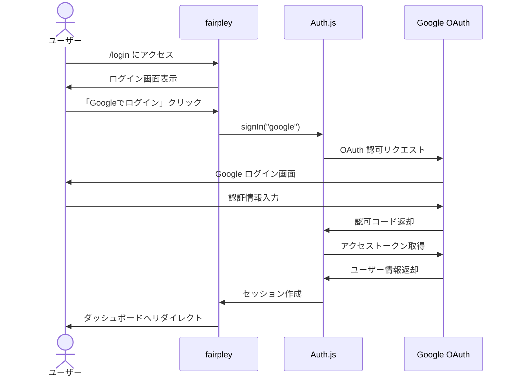
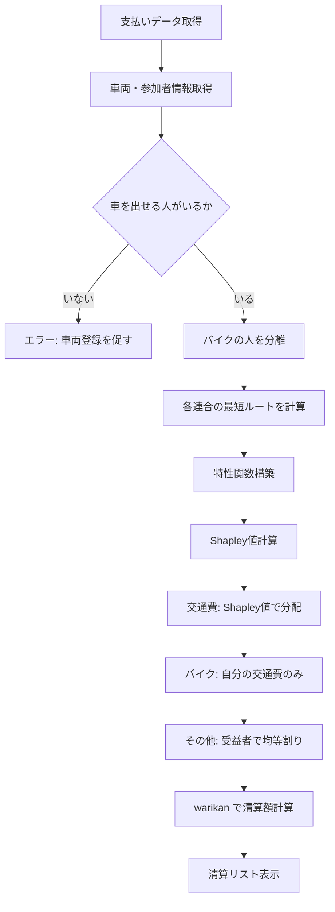

---
toc:
  depth_from: 2
  depth_to: 3
---

# fairpley 機能仕様書

本ドキュメントは fairpley の各機能の詳細設計を記述する。

[TOC]

---

## 1. 認証機能

### 1.1 概要

Auth.js v5 + Google OAuth を使用した認証システム。

### 1.2 認証フロー



### 1.3 Auth.js 設定

```typescript
// src/lib/auth.ts
import NextAuth from "next-auth";
import Google from "next-auth/providers/google";
import { PrismaAdapter } from "@auth/prisma-adapter";
import { prisma } from "./prisma";

export const { handlers, auth, signIn, signOut } = NextAuth({
  adapter: PrismaAdapter(prisma),
  providers: [
    Google({
      clientId: process.env.GOOGLE_CLIENT_ID!,
      clientSecret: process.env.GOOGLE_CLIENT_SECRET!,
    }),
  ],
  events: {
    // 新規ユーザー作成時のロール設定
    async createUser({ user }) {
      // 初回ユーザーは管理者、以降は承認待ち
      const userCount = await prisma.user.count();
      const role = userCount === 1 ? "ADMIN" : "PENDING";
      await prisma.user.update({
        where: { id: user.id },
        data: { role },
      });
    },
  },
  callbacks: {
    session({ session, user }) {
      session.user.id = user.id;
      session.user.role = user.role;
      return session;
    },
  },
  pages: {
    signIn: "/login",
  },
});

// 型拡張
declare module "next-auth" {
  interface Session {
    user: {
      id: string;
      role: "PENDING" | "MEMBER" | "ADMIN";
    } & DefaultSession["user"];
  }
  interface User {
    role: "PENDING" | "MEMBER" | "ADMIN";
  }
}
```

### 1.4 ミドルウェア

```typescript
// src/middleware.ts
import { auth } from "@/lib/auth";

export default auth((req) => {
  const isLoggedIn = !!req.auth;
  const userRole = req.auth?.user?.role;
  const isLoginPage = req.nextUrl.pathname === "/login";
  const isPendingPage = req.nextUrl.pathname === "/pending";
  const isAdminRoute = req.nextUrl.pathname.startsWith("/admin");
  const isAuthRoute = req.nextUrl.pathname.startsWith("/api/auth");

  // 認証ルートはスキップ
  if (isAuthRoute) return;

  // 未認証ユーザーはログインページへ
  if (!isLoggedIn && !isLoginPage) {
    return Response.redirect(new URL("/login", req.nextUrl));
  }

  // 認証済みユーザーがログインページにアクセスした場合
  if (isLoggedIn && isLoginPage) {
    return Response.redirect(new URL("/", req.nextUrl));
  }

  // 承認待ちユーザーは承認待ちページのみアクセス可能
  if (isLoggedIn && userRole === "PENDING" && !isPendingPage) {
    return Response.redirect(new URL("/pending", req.nextUrl));
  }

  // 承認済みユーザーが承認待ちページにアクセスした場合
  if (isLoggedIn && userRole !== "PENDING" && isPendingPage) {
    return Response.redirect(new URL("/", req.nextUrl));
  }

  // 管理者ルートは管理者のみアクセス可能
  if (isAdminRoute && userRole !== "ADMIN") {
    return Response.redirect(new URL("/", req.nextUrl));
  }
});

export const config = {
  matcher: ["/((?!_next/static|_next/image|favicon.ico).*)"],
};
```

### 1.5 エラーハンドリング

| エラー             | 原因                   | 対処                               |
| ------------------ | ---------------------- | ---------------------------------- |
| OAuthCallbackError | OAuth コールバック失敗 | エラーメッセージ表示、再試行を促す |
| SessionExpired     | セッション期限切れ     | ログインページへリダイレクト       |

---

## 2. イベント管理機能

### 2.1 概要

キャンプなどのイベントを作成・管理する機能。

### 2.2 Server Actions

#### 2.2.1 イベント作成

```typescript
// src/actions/event.ts
"use server";

import { auth } from "@/lib/auth";
import { prisma } from "@/lib/prisma";
import { revalidatePath } from "next/cache";
import { redirect } from "next/navigation";
import { z } from "zod";

const createEventSchema = z.object({
  name: z.string().min(1, "イベント名は必須です").max(100),
  startDate: z.coerce.date(),
  endDate: z.coerce.date(),
}).refine(
  (data) => data.endDate >= data.startDate,
  { message: "終了日は開始日以降にしてください", path: ["endDate"] }
);

export async function createEvent(formData: FormData) {
  const session = await auth();
  if (!session?.user?.id) {
    throw new Error("認証が必要です");
  }

  const validatedFields = createEventSchema.safeParse({
    name: formData.get("name"),
    startDate: formData.get("startDate"),
    endDate: formData.get("endDate"),
  });

  if (!validatedFields.success) {
    return { error: validatedFields.error.flatten().fieldErrors };
  }

  const { name, startDate, endDate } = validatedFields.data;

  const event = await prisma.event.create({
    data: {
      name,
      startDate,
      endDate,
      ownerId: session.user.id,
      members: {
        create: {
          userId: session.user.id,
          // オーナーは自動的に参加者になる
        },
      },
    },
  });

  revalidatePath("/");
  redirect(`/events/${event.id}`);
}
```

#### 2.2.2 イベント更新

```typescript
const updateEventSchema = z.object({
  id: z.string().uuid(),
  name: z.string().min(1).max(100),
  startDate: z.coerce.date(),
  endDate: z.coerce.date(),
  gasPricePerLiter: z.number().int().min(1).max(500).default(170),
});

export async function updateEvent(formData: FormData) {
  const session = await auth();
  if (!session?.user?.id) {
    throw new Error("認証が必要です");
  }

  const validatedFields = updateEventSchema.safeParse({
    id: formData.get("id"),
    name: formData.get("name"),
    startDate: formData.get("startDate"),
    endDate: formData.get("endDate"),
    gasPricePerLiter: parseInt(formData.get("gasPricePerLiter") as string),
  });

  if (!validatedFields.success) {
    return { error: validatedFields.error.flatten().fieldErrors };
  }

  const { id, ...data } = validatedFields.data;

  // オーナーのみ更新可能
  const event = await prisma.event.findUnique({
    where: { id },
    select: { ownerId: true },
  });

  if (event?.ownerId !== session.user.id) {
    throw new Error("イベントの更新権限がありません");
  }

  await prisma.event.update({
    where: { id },
    data,
  });

  revalidatePath(`/events/${id}`);
}
```

#### 2.2.3 イベント削除

```typescript
export async function deleteEvent(eventId: string) {
  const session = await auth();
  if (!session?.user?.id) {
    throw new Error("認証が必要です");
  }

  // オーナーのみ削除可能
  const event = await prisma.event.findUnique({
    where: { id: eventId },
    select: { ownerId: true },
  });

  if (event?.ownerId !== session.user.id) {
    throw new Error("イベントの削除権限がありません");
  }

  // カスケード削除（関連データも削除）
  await prisma.event.delete({
    where: { id: eventId },
  });

  revalidatePath("/");
  redirect("/");
}
```

### 2.3 データ取得

```typescript
// src/data/event.ts
import { auth } from "@/lib/auth";
import { prisma } from "@/lib/prisma";

export async function getMyEvents() {
  const session = await auth();
  if (!session?.user?.id) return [];

  return prisma.event.findMany({
    where: {
      members: {
        some: { userId: session.user.id },
      },
    },
    include: {
      members: {
        include: { user: true },
      },
      _count: {
        select: { payments: true },
      },
    },
    orderBy: { startDate: "desc" },
  });
}

export async function getEventById(eventId: string) {
  const session = await auth();
  if (!session?.user?.id) return null;

  const event = await prisma.event.findUnique({
    where: { id: eventId },
    include: {
      owner: true,
      members: {
        include: {
          user: true,
          vehicles: true,
        },
      },
      payments: {
        include: {
          payer: true,
          beneficiaries: true,
        },
        orderBy: { createdAt: "desc" },
      },
      trips: {
        include: {
          vehicle: true,
          from: true,
          to: true,
          passengers: {
            include: { member: true },
          },
        },
      },
    },
  });

  // アクセス権チェック（参加者のみ閲覧可能）
  const isMember = event?.members.some(
    (m) => m.userId === session.user.id
  );

  if (!isMember) return null;

  return event;
}

export async function getEventPayments(eventId: string) {
  const session = await auth();
  if (!session?.user?.id) return null;

  // アクセス権チェック
  const isMember = await prisma.eventMember.findUnique({
    where: {
      eventId_userId: { eventId, userId: session.user.id },
    },
  });

  if (!isMember) return null;

  return prisma.payment.findMany({
    where: { eventId },
    include: {
      payer: true,
      beneficiaries: {
        include: { member: { include: { user: true } } },
      },
    },
    orderBy: { createdAt: "desc" },
  });
}
```

---

## 3. 参加者管理機能

### 3.1 概要

イベントへの参加者を追加・管理する機能。各参加者はイベントごとに出発地を設定できる（未設定の場合はプロフィールの自宅を使用）。

### 3.2 Server Actions

#### 3.2.1 参加者追加

```typescript
// src/actions/member.ts
"use server";

const addMemberSchema = z.object({
  eventId: z.string().uuid(),
  email: z.string().email("有効なメールアドレスを入力してください"),
  nickname: z.string().max(50).optional(),
  departureLocationId: z.string().uuid().optional(), // イベントでの出発地（未設定ならプロフィールの自宅）
});

export async function addMember(formData: FormData) {
  const session = await auth();
  if (!session?.user?.id) {
    throw new Error("認証が必要です");
  }

  const validatedFields = addMemberSchema.safeParse({
    eventId: formData.get("eventId"),
    email: formData.get("email"),
    nickname: formData.get("nickname"),
  });

  if (!validatedFields.success) {
    return { error: validatedFields.error.flatten().fieldErrors };
  }

  const { eventId, email, nickname } = validatedFields.data;

  // イベントへのアクセス権チェック
  const event = await prisma.event.findFirst({
    where: {
      id: eventId,
      members: { some: { userId: session.user.id } },
    },
  });

  if (!event) {
    throw new Error("イベントが見つかりません");
  }

  // ユーザーを検索または作成
  let user = await prisma.user.findUnique({
    where: { email },
  });

  if (!user) {
    // 未登録ユーザーはプレースホルダーとして作成
    user = await prisma.user.create({
      data: {
        email,
        name: nickname || email.split("@")[0],
      },
    });
  }

  // 既に参加者かチェック
  const existingMember = await prisma.eventMember.findUnique({
    where: {
      eventId_userId: { eventId, userId: user.id },
    },
  });

  if (existingMember) {
    return { error: { email: ["この参加者は既に登録されています"] } };
  }

  const { departureLocationId } = validatedFields.data;

  await prisma.eventMember.create({
    data: {
      eventId,
      userId: user.id,
      nickname,
      departureLocationId,
    },
  });

  revalidatePath(`/events/${eventId}`);
}
```

#### 3.2.2 出発地更新

```typescript
const updateDepartureSchema = z.object({
  memberId: z.string().uuid(),
  eventId: z.string().uuid(),
  departureLocationId: z.string().uuid().nullable(),
});

export async function updateDepartureLocation(formData: FormData) {
  const session = await auth();
  if (!session?.user?.id) {
    throw new Error("認証が必要です");
  }

  const validatedFields = updateDepartureSchema.safeParse({
    memberId: formData.get("memberId"),
    eventId: formData.get("eventId"),
    departureLocationId: formData.get("departureLocationId") || null,
  });

  if (!validatedFields.success) {
    return { error: validatedFields.error.flatten().fieldErrors };
  }

  const { memberId, eventId, departureLocationId } = validatedFields.data;

  // イベントへのアクセス権チェック
  await checkEventAccess(eventId, session.user.id);

  // 自分自身のみ更新可能
  const member = await prisma.eventMember.findUnique({
    where: { id: memberId },
    select: { userId: true },
  });

  if (member?.userId !== session.user.id) {
    throw new Error("自分の出発地のみ更新できます");
  }

  await prisma.eventMember.update({
    where: { id: memberId },
    data: { departureLocationId },
  });

  revalidatePath(`/events/${eventId}`);
}
```

#### 3.2.3 参加者削除

```typescript
export async function removeMember(eventId: string, memberId: string) {
  const session = await auth();
  if (!session?.user?.id) {
    throw new Error("認証が必要です");
  }

  // オーナーのみ削除可能
  const event = await prisma.event.findUnique({
    where: { id: eventId },
    select: { ownerId: true },
  });

  if (event?.ownerId !== session.user.id) {
    throw new Error("参加者を削除する権限がありません");
  }

  // オーナー自身は削除不可
  const member = await prisma.eventMember.findUnique({
    where: { id: memberId },
    select: { userId: true },
  });

  if (member?.userId === session.user.id) {
    throw new Error("オーナーは削除できません");
  }

  // 関連データをチェック（支払いや乗車記録がある場合は削除不可）
  const hasPayments = await prisma.payment.count({
    where: {
      eventId,
      OR: [
        { payerId: member?.userId },
        { beneficiaries: { some: { memberId } } },
      ],
    },
  });

  if (hasPayments > 0) {
    throw new Error("支払い記録がある参加者は削除できません");
  }

  await prisma.eventMember.delete({
    where: { id: memberId },
  });

  revalidatePath(`/events/${eventId}`);
}
```

---

## 4. 場所管理機能

### 4.1 概要

キャンプ場や集合場所などの場所を登録・管理する機能。Google Maps API と連携して場所を検索・登録する。

### 4.2 Server Actions

#### 4.2.1 場所追加

```typescript
// src/actions/location.ts
"use server";

const addLocationSchema = z.object({
  eventId: z.string().uuid(), // revalidatePath 用
  name: z.string().min(1).max(100),
  address: z.string().optional(),
  lat: z.number(),
  lng: z.number(),
  type: z.enum(["HOME", "CAMPSITE", "STORE", "OTHER"]),
});

export async function addLocation(formData: FormData) {
  const session = await auth();
  if (!session?.user?.id) {
    throw new Error("認証が必要です");
  }

  const validatedFields = addLocationSchema.safeParse({
    eventId: formData.get("eventId"),
    name: formData.get("name"),
    address: formData.get("address"),
    lat: parseFloat(formData.get("lat") as string),
    lng: parseFloat(formData.get("lng") as string),
    type: formData.get("type"),
  });

  if (!validatedFields.success) {
    return { error: validatedFields.error.flatten().fieldErrors };
  }

  const { eventId, ...data } = validatedFields.data;

  // 認証済みユーザーは全員追加可能（グローバル共有）
  await prisma.location.create({
    data,
  });

  revalidatePath(`/events/${eventId}/locations`);
}
```

### 4.3 データ取得

```typescript
// src/data/location.ts
import { auth } from "@/lib/auth";
import { prisma } from "@/lib/prisma";

export async function getLocations() {
  const session = await auth();
  if (!session?.user?.id) {
    throw new Error("認証が必要です");
  }

  return prisma.location.findMany({
    orderBy: { createdAt: "desc" },
  });
}
```

### 4.4 Server Actions（続き）

#### 4.4.1 場所更新

```typescript
// src/actions/location.ts

const updateLocationSchema = z.object({
  id: z.string().uuid(),
  eventId: z.string().uuid(), // revalidatePath 用
  name: z.string().min(1).max(100),
  address: z.string().optional(),
  lat: z.number(),
  lng: z.number(),
  type: z.enum(["HOME", "CAMPSITE", "STORE", "OTHER"]),
});

export async function updateLocation(formData: FormData) {
  const session = await auth();
  if (!session?.user?.id) {
    throw new Error("認証が必要です");
  }

  const validatedFields = updateLocationSchema.safeParse({
    id: formData.get("id"),
    eventId: formData.get("eventId"),
    name: formData.get("name"),
    address: formData.get("address"),
    lat: parseFloat(formData.get("lat") as string),
    lng: parseFloat(formData.get("lng") as string),
    type: formData.get("type"),
  });

  if (!validatedFields.success) {
    return { error: validatedFields.error.flatten().fieldErrors };
  }

  const { id, eventId, ...data } = validatedFields.data;

  await prisma.location.update({
    where: { id },
    data,
  });

  revalidatePath(`/events/${eventId}/locations`);
}
```

#### 4.4.2 場所削除

```typescript
// src/actions/location.ts

const deleteLocationSchema = z.object({
  id: z.string().uuid(),
  eventId: z.string().uuid(), // revalidatePath 用
});

export async function deleteLocation(formData: FormData) {
  const session = await auth();
  if (!session?.user?.id) {
    throw new Error("認証が必要です");
  }

  const validatedFields = deleteLocationSchema.safeParse({
    id: formData.get("id"),
    eventId: formData.get("eventId"),
  });

  if (!validatedFields.success) {
    return { error: validatedFields.error.flatten().fieldErrors };
  }

  const { id, eventId } = validatedFields.data;

  await prisma.location.delete({
    where: { id },
  });

  revalidatePath(`/events/${eventId}/locations`);
}
```

### 4.5 Google Maps API 連携

```typescript
// src/lib/google-maps.ts

interface PlaceResult {
  name: string;
  address: string;
  lat: number;
  lng: number;
}

export async function searchPlaces(query: string): Promise<PlaceResult[]> {
  const response = await fetch(
    `https://maps.googleapis.com/maps/api/place/textsearch/json?` +
    `query=${encodeURIComponent(query)}&` +
    `language=ja&` +
    `key=${process.env.GOOGLE_MAPS_API_KEY}`
  );

  const data = await response.json();

  return data.results.map((place: any) => ({
    name: place.name,
    address: place.formatted_address,
    lat: place.geometry.location.lat,
    lng: place.geometry.location.lng,
  }));
}

interface DistanceResult {
  distanceMeters: number;
  durationSeconds: number;
}

export async function getDistance(
  origin: { lat: number; lng: number },
  destination: { lat: number; lng: number }
): Promise<DistanceResult> {
  const response = await fetch(
    `https://maps.googleapis.com/maps/api/distancematrix/json?` +
    `origins=${origin.lat},${origin.lng}&` +
    `destinations=${destination.lat},${destination.lng}&` +
    `key=${process.env.GOOGLE_MAPS_API_KEY}`
  );

  const data = await response.json();
  const element = data.rows[0].elements[0];

  return {
    distanceMeters: element.distance.value,
    durationSeconds: element.duration.value,
  };
}
```

---

## 5. 車両管理機能

### 5.1 概要

自家用車、レンタカー、カーシェア、バイクなどの車両を登録・管理する機能。

**車両タイプ:**

- **OWNED（自家用車）**: 乗り合いで使用、Shapley計算に含める
- **RENTAL（レンタカー/カーシェア）**: 乗り合いで使用、Shapley計算に含める
- **BIKE（バイク）**: 単独移動、Shapley計算から除外（自分の交通費のみ負担）

### 5.2 Server Actions

#### 5.2.1 自家用車追加

```typescript
// src/actions/vehicle.ts
"use server";

const addOwnedVehicleSchema = z.object({
  eventId: z.string().uuid(),
  name: z.string().min(1).max(100),
  ownerId: z.string().uuid(), // EventMember の ID
  capacity: z.number().int().min(2).max(10),
  fuelEfficiency: z.number().positive().optional(),
});

export async function addOwnedVehicle(formData: FormData) {
  const session = await auth();
  if (!session?.user?.id) {
    throw new Error("認証が必要です");
  }

  const validatedFields = addOwnedVehicleSchema.safeParse({
    eventId: formData.get("eventId"),
    name: formData.get("name"),
    ownerId: formData.get("ownerId"),
    capacity: parseInt(formData.get("capacity") as string),
    fuelEfficiency: formData.get("fuelEfficiency")
      ? parseFloat(formData.get("fuelEfficiency") as string)
      : undefined,
  });

  if (!validatedFields.success) {
    return { error: validatedFields.error.flatten().fieldErrors };
  }

  const { eventId, ...data } = validatedFields.data;

  await checkEventAccess(eventId, session.user.id);

  await prisma.vehicle.create({
    data: {
      ...data,
      type: "OWNED",
    },
  });

  revalidatePath(`/events/${eventId}/vehicles`);
}
```

#### 5.2.2 レンタカーオプション追加

```typescript
const addRentalOptionSchema = z.object({
  eventId: z.string().uuid(),
  name: z.string().min(1).max(100),
  provider: z.string().min(1).max(100),
  baseFee: z.number().int().nonnegative(),
  distanceFee: z.number().int().nonnegative().optional(),
  insuranceFee: z.number().int().nonnegative().optional(),
  capacity: z.number().int().min(2).max(10),
});

export async function addRentalOption(formData: FormData) {
  const session = await auth();
  if (!session?.user?.id) {
    throw new Error("認証が必要です");
  }

  const validatedFields = addRentalOptionSchema.safeParse({
    eventId: formData.get("eventId"),
    name: formData.get("name"),
    provider: formData.get("provider"),
    baseFee: parseInt(formData.get("baseFee") as string),
    distanceFee: formData.get("distanceFee")
      ? parseInt(formData.get("distanceFee") as string)
      : undefined,
    insuranceFee: formData.get("insuranceFee")
      ? parseInt(formData.get("insuranceFee") as string)
      : undefined,
    capacity: parseInt(formData.get("capacity") as string),
  });

  if (!validatedFields.success) {
    return { error: validatedFields.error.flatten().fieldErrors };
  }

  const data = validatedFields.data;

  await checkEventAccess(data.eventId, session.user.id);

  await prisma.rentalOption.create({
    data,
  });

  revalidatePath(`/events/${data.eventId}/vehicles`);
}
```

#### 5.2.3 バイク追加

```typescript
const addBikeSchema = z.object({
  eventId: z.string().uuid(),
  name: z.string().min(1).max(100),
  ownerId: z.string().uuid(), // EventMember の ID
  fuelEfficiency: z.number().positive().optional(),
});

export async function addBike(formData: FormData) {
  const session = await auth();
  if (!session?.user?.id) {
    throw new Error("認証が必要です");
  }

  const validatedFields = addBikeSchema.safeParse({
    eventId: formData.get("eventId"),
    name: formData.get("name"),
    ownerId: formData.get("ownerId"),
    fuelEfficiency: formData.get("fuelEfficiency")
      ? parseFloat(formData.get("fuelEfficiency") as string)
      : undefined,
  });

  if (!validatedFields.success) {
    return { error: validatedFields.error.flatten().fieldErrors };
  }

  const { eventId, ...data } = validatedFields.data;

  await checkEventAccess(eventId, session.user.id);

  await prisma.vehicle.create({
    data: {
      ...data,
      type: "BIKE",
      capacity: 1, // バイクは1人乗り
    },
  });

  revalidatePath(`/events/${eventId}/vehicles`);
}
```

---

## 6. 支払い記録機能

### 6.1 概要

各参加者の支払い（食費、交通費など）を記録する機能。

**交通費フラグ（isTransport）:**

- **true**: 交通費（ガソリン代、高速代など）→ Shapley値で分配
- **false**: その他の支払い（食費、宿泊費など）→ 受益者で均等割り

### 6.2 Server Actions

#### 6.2.1 支払い追加

```typescript
// src/actions/payment.ts
"use server";

const addPaymentSchema = z.object({
  eventId: z.string().uuid(),
  payerId: z.string().uuid(), // 支払者（参加者から選択）
  amount: z.number().int().positive("金額は1円以上にしてください"),
  description: z.string().min(1).max(200),
  isTransport: z.boolean().default(false), // 交通費かどうか
  beneficiaryIds: z.array(z.string().uuid()).min(1, "受益者を選択してください"),
});

export async function addPayment(formData: FormData) {
  const session = await auth();
  if (!session?.user?.id) {
    throw new Error("認証が必要です");
  }

  const beneficiaryIds = formData.getAll("beneficiaryIds") as string[];

  const validatedFields = addPaymentSchema.safeParse({
    eventId: formData.get("eventId"),
    payerId: formData.get("payerId"),
    amount: parseInt(formData.get("amount") as string),
    description: formData.get("description"),
    isTransport: formData.get("isTransport") === "true",
    beneficiaryIds,
  });

  if (!validatedFields.success) {
    return { error: validatedFields.error.flatten().fieldErrors };
  }

  const { eventId, payerId, beneficiaryIds: beneficiaries, ...data } = validatedFields.data;

  await checkEventAccess(eventId, session.user.id);

  await prisma.payment.create({
    data: {
      ...data,
      eventId,
      payerId, // フォームで選択された支払者
      beneficiaries: {
        create: beneficiaries.map((memberId) => ({ memberId })),
      },
    },
  });

  revalidatePath(`/events/${eventId}`);
  redirect(`/events/${eventId}`);
}
```

#### 6.2.2 支払い更新

```typescript
const updatePaymentSchema = z.object({
  id: z.string().uuid(),
  eventId: z.string().uuid(),
  payerId: z.string().uuid(), // 支払者（参加者から選択）
  amount: z.number().int().positive("金額は1円以上にしてください"),
  description: z.string().min(1).max(200),
  isTransport: z.boolean().default(false), // 交通費かどうか
  beneficiaryIds: z.array(z.string().uuid()).min(1, "受益者を選択してください"),
});

export async function updatePayment(formData: FormData) {
  const session = await auth();
  if (!session?.user?.id) {
    throw new Error("認証が必要です");
  }

  const beneficiaryIds = formData.getAll("beneficiaryIds") as string[];

  const validatedFields = updatePaymentSchema.safeParse({
    id: formData.get("id"),
    eventId: formData.get("eventId"),
    payerId: formData.get("payerId"),
    amount: parseInt(formData.get("amount") as string),
    description: formData.get("description"),
    isTransport: formData.get("isTransport") === "true",
    beneficiaryIds,
  });

  if (!validatedFields.success) {
    return { error: validatedFields.error.flatten().fieldErrors };
  }

  const { id, eventId, payerId, beneficiaryIds: beneficiaries, ...data } = validatedFields.data;

  // イベント参加者であれば誰でも更新可能（性善説）
  await checkEventAccess(eventId, session.user.id);

  // トランザクションで更新
  await prisma.$transaction([
    // 既存の受益者を削除
    prisma.paymentBeneficiary.deleteMany({
      where: { paymentId: id },
    }),
    // 支払いを更新
    prisma.payment.update({
      where: { id },
      data: {
        ...data,
        payerId, // フォームで選択された支払者
        beneficiaries: {
          create: beneficiaries.map((memberId) => ({ memberId })),
        },
      },
    }),
  ]);

  revalidatePath(`/events/${eventId}`);
  revalidatePath(`/events/${eventId}/payments`);
}
```

#### 6.2.3 支払い削除

```typescript
export async function deletePayment(eventId: string, paymentId: string) {
  const session = await auth();
  if (!session?.user?.id) {
    throw new Error("認証が必要です");
  }

  // イベント参加者であれば誰でも削除可能（性善説）
  await checkEventAccess(eventId, session.user.id);

  await prisma.payment.delete({
    where: { id: paymentId },
  });

  revalidatePath(`/events/${eventId}`);
  revalidatePath(`/events/${eventId}/payments`);
}
```

---

## 7. ルート計算機能

### 7.1 概要

各連合について、参加者の家を回る最短ルートを自動計算する機能。Shapley値の特性関数で使用。

### 7.2 入力データ

- 各参加者の出発地（自宅またはイベントで指定した場所）
- 目的地（キャンプ場）

### 7.3 計算方法

- **Google Maps Distance Matrix API**で地点間の距離を取得
- **最寄り法（Nearest Neighbor）**で巡回ルートを近似
- 往復距離を算出

### 7.4 実装

```typescript
// src/lib/route.ts
import { getDistance } from "./google-maps";

interface Location {
  lat: number;
  lng: number;
}

/**
 * 出発地リストと目的地から最短ルートの総距離を計算
 * 巡回セールスマン問題の近似解を使用
 */
export async function calculateOptimalRoute(
  departures: Location[],
  destination: Location
): Promise<number> {
  if (departures.length === 0) return 0;
  if (departures.length === 1) {
    // 1人の場合: 出発地 → 目的地 → 出発地（往復）
    const oneWay = await getDistance(departures[0], destination);
    return oneWay.distanceMeters * 2 / 1000; // km
  }

  // 複数人の場合: 最寄り法（Nearest Neighbor）で近似
  const allPoints = [...departures, destination];
  const visited = new Set<number>();
  let current = 0; // 最初の出発地から開始
  let totalDistance = 0;
  visited.add(0);

  while (visited.size < allPoints.length) {
    let nearestIdx = -1;
    let nearestDist = Infinity;

    for (let i = 0; i < allPoints.length; i++) {
      if (visited.has(i)) continue;
      const dist = await getDistance(allPoints[current], allPoints[i]);
      if (dist.distanceMeters < nearestDist) {
        nearestDist = dist.distanceMeters;
        nearestIdx = i;
      }
    }

    totalDistance += nearestDist;
    visited.add(nearestIdx);
    current = nearestIdx;
  }

  // 最後に出発地に戻る（往復）
  const returnDist = await getDistance(allPoints[current], departures[0]);
  totalDistance += returnDist.distanceMeters;

  return totalDistance / 1000; // km
}
```

### 7.5 特性関数での利用

```text
v(S) = {
  0                                      if S = {}
  最短ルート距離 × ガソリン単価 + 高速代  if S ∩ 車所有者 ≠ {}
  エラー                                  if S ∩ 車所有者 = {}
}
```

---

## 8. 計算・清算機能

### 8.1 概要

シャープレイ値で交通費を公平に分配し、warikan で清算額を算出する。

- **交通費（isTransport=true）**: Shapley値で分配
- **その他（isTransport=false）**: 受益者で均等割り
- **バイクの人**: Shapley計算から除外（自分の交通費のみ負担）

### 8.2 計算フロー



### 8.3 Server Actions

#### 8.3.1 清算計算

```typescript
// src/actions/settlement.ts
"use server";

import { calculateShapleyValues, type CharacteristicFunction } from "shapley";
import { solve, type Payment as WarikanPayment } from "warikan";
import { calculateOptimalRoute } from "@/lib/route";

interface SettlementResult {
  shapleyValues: { memberId: string; name: string; value: number }[];
  contributions: { memberId: string; name: string; paid: number; shouldPay: number }[];
  repayments: { from: string; to: string; amount: number }[];
}

export async function calculateSettlement(eventId: string): Promise<SettlementResult> {
  const session = await auth();
  if (!session?.user?.id) {
    throw new Error("認証が必要です");
  }

  // イベントデータ取得
  const event = await prisma.event.findUnique({
    where: { id: eventId },
    include: {
      members: {
        include: {
          user: { include: { homeLocation: true } },
          vehicles: true,
          departureLocation: true,
        },
      },
      payments: {
        include: { beneficiaries: true },
      },
      destination: true,
    },
  });

  if (!event) {
    throw new Error("イベントが見つかりません");
  }

  if (!event.destination) {
    throw new Error("目的地が設定されていません");
  }

  const members = event.members;
  const memberMap = new Map(members.map((m) => [m.id, m]));

  // 1. 車を出せる人がいるかチェック（バイク以外）
  const carOwners = members.filter((m) =>
    m.vehicles.some((v) => v.type !== "BIKE")
  );
  if (carOwners.length === 0) {
    throw new Error("車を出せる人がいません。車両情報を登録してください。");
  }

  // 2. バイクの人を分離
  const bikeMembers = members.filter((m) =>
    m.vehicles.some((v) => v.type === "BIKE")
  );
  const carRiders = members.filter((m) =>
    !m.vehicles.some((v) => v.type === "BIKE")
  );
  const carRiderIds = carRiders.map((m) => m.id);

  // 3. 特性関数を構築
  const characteristicFunction: CharacteristicFunction = async (coalition) => {
    if (coalition.length === 0) return 0;

    // 連合に車所有者がいるか
    const ownersInCoalition = coalition.filter((id) =>
      carOwners.some((m) => m.id === id)
    );

    if (ownersInCoalition.length === 0) {
      throw new Error("車を出せる人がいません");
    }

    // 各メンバーの出発地を取得
    const departures = coalition
      .map((id) => {
        const member = memberMap.get(id);
        const loc = member?.departureLocation || member?.user.homeLocation;
        return loc ? { lat: loc.lat, lng: loc.lng } : null;
      })
      .filter(Boolean) as { lat: number; lng: number }[];

    // 目的地
    const destination = { lat: event.destination!.lat, lng: event.destination!.lng };

    // 最短ルートの距離を計算
    const routeDistance = await calculateOptimalRoute(departures, destination);

    // ガソリン代を計算
    const fuelEfficiency = 10; // km/L（デフォルト）
    const gasPrice = event.gasPricePerLiter;
    const gasCost = (routeDistance / fuelEfficiency) * gasPrice;

    // 高速代は支払い記録から取得（isTransport=true かつ「高速」を含む）
    const highwayCost = event.payments
      .filter((p) => p.isTransport && p.description.includes("高速"))
      .reduce((sum, p) => sum + p.amount, 0);

    return gasCost + highwayCost;
  };

  // 4. 車に乗る人のShapley値を計算
  const shapleyResults = await calculateShapleyValues(carRiderIds, characteristicFunction);

  const normalizedShapley = shapleyResults.map((r) => ({
    memberId: r.player,
    name: memberMap.get(r.player)?.nickname || memberMap.get(r.player)?.user.name || "",
    value: r.value,
  }));

  // 5. 各人の支払い額と負担すべき額を計算
  const contributions = members.map((member) => {
    // 支払った額
    const paid = event.payments
      .filter((p) => p.payerId === member.userId)
      .reduce((sum, p) => sum + p.amount, 0);

    let shouldPay = 0;

    // 交通費以外: 受益者で均等割り
    for (const payment of event.payments) {
      if (payment.isTransport) continue;

      const isBeneficiary = payment.beneficiaries.some(
        (b) => b.memberId === member.id
      );
      if (isBeneficiary) {
        shouldPay += payment.amount / payment.beneficiaries.length;
      }
    }

    // 交通費
    const isBiker = bikeMembers.some((m) => m.id === member.id);
    if (isBiker) {
      // バイク: 自分の交通費支払いのみ
      const bikeTransportCost = event.payments
        .filter((p) => p.isTransport && p.payerId === member.userId)
        .reduce((sum, p) => sum + p.amount, 0);
      shouldPay += bikeTransportCost;
    } else {
      // 車: Shapley値で分配
      const shapley = normalizedShapley.find((s) => s.memberId === member.id);
      shouldPay += shapley?.value || 0;
    }

    return {
      memberId: member.id,
      name: member.nickname || member.user.name,
      paid: Math.round(paid),
      shouldPay: Math.round(shouldPay),
    };
  });

  // 6. warikan で清算額を計算
  const BANK = "__SETTLEMENT_BANK__";
  const warikanPayments: WarikanPayment[] = [];

  for (const c of contributions) {
    const balance = c.paid - c.shouldPay;
    if (balance > 0) {
      warikanPayments.push({
        amount: Math.round(balance),
        payer: c.memberId,
        beneficiaries: [BANK],
      });
    } else if (balance < 0) {
      warikanPayments.push({
        amount: Math.round(-balance),
        payer: BANK,
        beneficiaries: [c.memberId],
      });
    }
  }

  const rawRepayments = solve(warikanPayments);
  const nameMap = new Map(members.map((m) => [m.id, m.nickname || m.user.name]));

  const repayments = rawRepayments.map((r) => ({
    from: nameMap.get(r.from) || r.from,
    to: nameMap.get(r.to) || r.to,
    amount: r.amount,
  }));

  return {
    shapleyValues: normalizedShapley,
    contributions,
    repayments,
  };
}
```

### 8.4 エラーハンドリング

| エラー                   | 原因                       | 対処                             |
| ------------------------ | -------------------------- | -------------------------------- |
| EmptyPlayersError        | 参加者がいない             | 参加者を追加するよう促す         |
| 車を出せる人がいない     | 車両（バイク以外）が未登録 | 車両情報を登録するよう促す       |
| 目的地が設定されていない | イベントの目的地が未設定   | イベント設定で目的地を登録       |
| 出発地が設定されていない | 参加者の出発地が未設定     | プロフィールで自宅を登録         |
| 計算結果が NaN           | 特性関数のエラー           | エラーログ記録、デフォルト値使用 |

### 8.5 計算例

**状況**: A, B, C, Dの4人でキャンプ。

- A: 車所有（東京）
- B: 車なし（横浜）
- C: 車なし（千葉）
- D: バイク所有（埼玉）→ Shapley計算から除外

**支払い記録**:

- ガソリン代: 5,000円（Aが支払い、isTransport=true）
- 高速代: 3,000円（Aが支払い、isTransport=true）
- Dのバイクガソリン代: 1,500円（Dが支払い、isTransport=true）
- 食費: 12,000円（Bが支払い、isTransport=false、全員で均等割り）

**Shapley計算（A, B, Cのみ）**:

| 連合S   | 最短ルート                     | 距離  | コストv(S) |
| ------- | ------------------------------ | ----- | ---------- |
| {A}     | 東京→キャンプ場→東京           | 200km | 8,000円    |
| {B}     | -                              | -     | (エラー)   |
| {C}     | -                              | -     | (エラー)   |
| {A,B}   | 東京→横浜→キャンプ場→横浜→東京 | 240km | 9,600円    |
| {A,C}   | 東京→千葉→キャンプ場→千葉→東京 | 260km | 10,400円   |
| {B,C}   | -                              | -     | (エラー)   |
| {A,B,C} | 最適ルート                     | 280km | 11,200円   |

**結果**:

- A: 車を出す貢献により負担軽減
- B, C: 拾ってもらう分のコスト増加分を負担
- D: バイクガソリン代 1,500円（自分の分のみ）+ 食費 3,000円

---

## 9. 管理者機能

### 9.1 概要

管理者がユーザーの承認・管理を行う機能。

### 9.2 Server Actions

#### 9.2.1 承認待ちユーザー一覧取得

```typescript
// src/data/admin.ts
import { auth } from "@/lib/auth";
import { prisma } from "@/lib/prisma";

export async function getPendingUsers() {
  const session = await auth();
  if (session?.user?.role !== "ADMIN") {
    throw new Error("管理者権限が必要です");
  }

  return prisma.user.findMany({
    where: { role: "PENDING" },
    orderBy: { createdAt: "desc" },
  });
}

export async function getAllUsers() {
  const session = await auth();
  if (session?.user?.role !== "ADMIN") {
    throw new Error("管理者権限が必要です");
  }

  return prisma.user.findMany({
    orderBy: { createdAt: "desc" },
  });
}
```

#### 9.2.2 ユーザー承認

```typescript
// src/actions/admin.ts
"use server";

import { auth } from "@/lib/auth";
import { prisma } from "@/lib/prisma";
import { revalidatePath } from "next/cache";

export async function approveUser(userId: string) {
  const session = await auth();
  if (session?.user?.role !== "ADMIN") {
    throw new Error("管理者権限が必要です");
  }

  await prisma.user.update({
    where: { id: userId },
    data: { role: "MEMBER" },
  });

  revalidatePath("/admin/users");
}
```

#### 9.2.3 ユーザーを管理者に昇格

```typescript
export async function promoteToAdmin(userId: string) {
  const session = await auth();
  if (session?.user?.role !== "ADMIN") {
    throw new Error("管理者権限が必要です");
  }

  await prisma.user.update({
    where: { id: userId },
    data: { role: "ADMIN" },
  });

  revalidatePath("/admin/users");
}
```

#### 9.2.4 ユーザー削除（承認拒否）

```typescript
export async function rejectUser(userId: string) {
  const session = await auth();
  if (session?.user?.role !== "ADMIN") {
    throw new Error("管理者権限が必要です");
  }

  // 自分自身は削除不可
  if (userId === session.user.id) {
    throw new Error("自分自身を削除することはできません");
  }

  await prisma.user.delete({
    where: { id: userId },
  });

  revalidatePath("/admin/users");
}
```

---

## 共通ユーティリティ

### アクセス権チェック

```typescript
// src/lib/access.ts
export async function checkEventAccess(eventId: string, userId: string) {
  const event = await prisma.event.findFirst({
    where: {
      id: eventId,
      members: { some: { userId } },
    },
  });

  if (!event) {
    throw new Error("イベントにアクセスする権限がありません");
  }

  return event;
}

export async function checkEventOwner(eventId: string, userId: string) {
  const event = await prisma.event.findUnique({
    where: { id: eventId },
    select: { ownerId: true },
  });

  if (event?.ownerId !== userId) {
    throw new Error("この操作を行う権限がありません");
  }

  return event;
}
```

### エラーハンドリング

```typescript
// src/lib/errors.ts
export class AppError extends Error {
  constructor(
    message: string,
    public code: string,
    public statusCode: number = 400
  ) {
    super(message);
    this.name = "AppError";
  }
}

export class UnauthorizedError extends AppError {
  constructor(message = "認証が必要です") {
    super(message, "UNAUTHORIZED", 401);
  }
}

export class ForbiddenError extends AppError {
  constructor(message = "この操作を行う権限がありません") {
    super(message, "FORBIDDEN", 403);
  }
}

export class NotFoundError extends AppError {
  constructor(message = "リソースが見つかりません") {
    super(message, "NOT_FOUND", 404);
  }
}
```
