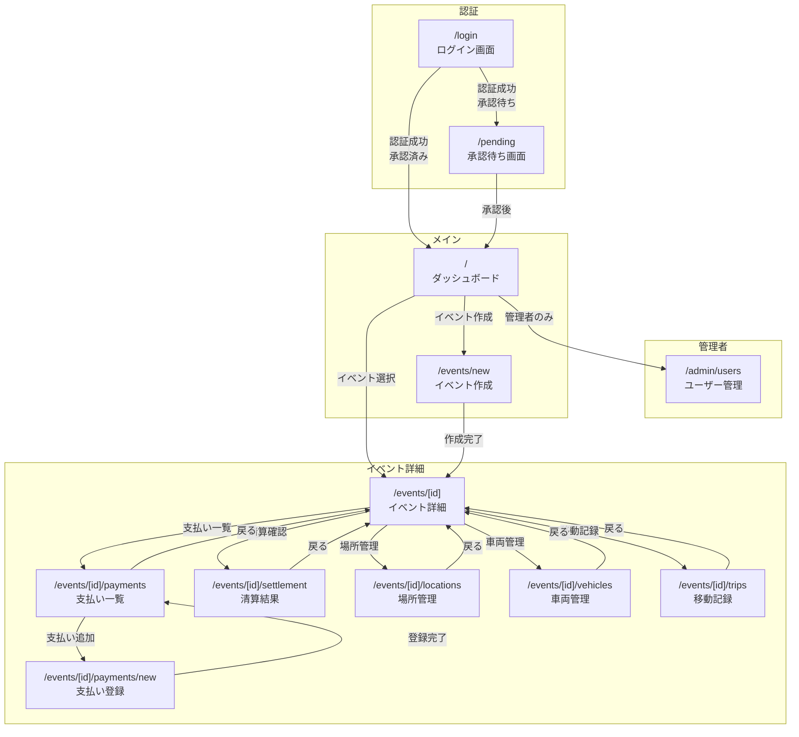

---
toc:
  depth_from: 2
  depth_to: 3
---

# fairpley 画面仕様書

本ドキュメントは fairpley の画面設計を記述する。

[TOC]

---

## 1. 画面遷移図



---

## 2. 共通コンポーネント

### 2.1 ヘッダー

```text
┌─────────────────────────────────────────────────────────────────┐
│  🏕 fairpley                                    [ユーザー名] ▼  │
└─────────────────────────────────────────────────────────────────┘
```

**構成要素**:

- ロゴ（ホームへのリンク）
- ユーザーメニュー（ドロップダウン）
  - プロフィール
  - ログアウト

### 2.2 サイドナビゲーション（イベント詳細画面内）

```text
┌──────────────────┐
│ 📋 概要          │
│ 💰 支払い        │
│ 📍 場所          │
│ 🚗 車両          │
│ 🛣️ 移動          │
│ 💵 清算          │
└──────────────────┘
```

### 2.3 ローディング・エラー状態

**ローディング**:

```text
┌─────────────────────┐
│   ⟳ 読み込み中...   │
└─────────────────────┘
```

**エラー**:

```text
┌─────────────────────────────────┐
│  ⚠️ エラーが発生しました        │
│  [再試行]                       │
└─────────────────────────────────┘
```

---

## 3. 画面詳細

### 3.1 ログイン画面 (`/login`)

#### ワイヤーフレーム（ログイン）

```text
┌─────────────────────────────────────────────────────────────────┐
│                                                                 │
│                         🏕 fairpley                             │
│                                                                 │
│                   キャンプ費用を公平に分担                       │
│                                                                 │
│               ┌─────────────────────────────────┐               │
│               │    🔵 Google でログイン          │               │
│               └─────────────────────────────────┘               │
│                                                                 │
│                                                                 │
└─────────────────────────────────────────────────────────────────┘
```

#### 仕様（ログイン）

| 項目 | 内容                    |
| ---- | ----------------------- |
| パス | `/login`                |
| 認証 | 不要                    |
| 機能 | Google OAuth でログイン |

#### アクション（ログイン）

| 要素                  | イベント | 処理                    |
| --------------------- | -------- | ----------------------- |
| Google ログインボタン | クリック | `signIn("google")` 実行 |

---

### 3.2 承認待ち画面 (`/pending`)

#### ワイヤーフレーム（承認待ち）

```text
┌─────────────────────────────────────────────────────────────────┐
│                                                                 │
│                         🏕 fairpley                             │
│                                                                 │
│                     ⏳ 承認待ち                                 │
│                                                                 │
│           管理者の承認をお待ちください。                         │
│           承認されると、アプリを利用できます。                   │
│                                                                 │
│               ┌─────────────────────────────────┐               │
│               │         ログアウト              │               │
│               └─────────────────────────────────┘               │
│                                                                 │
└─────────────────────────────────────────────────────────────────┘
```

#### 仕様（承認待ち）

| 項目 | 内容                                 |
| ---- | ------------------------------------ |
| パス | `/pending`                           |
| 認証 | 必須（PENDING ロールのみ表示）       |
| 機能 | 承認待ち状態を表示                   |

#### アクション（承認待ち）

| 要素             | イベント | 処理               |
| ---------------- | -------- | ------------------ |
| ログアウトボタン | クリック | `signOut()` 実行   |

---

### 3.3 ダッシュボード (`/`)

#### ワイヤーフレーム（ダッシュボード）

```text
┌─────────────────────────────────────────────────────────────────┐
│  🏕 fairpley                                    [田中さん] ▼    │
├─────────────────────────────────────────────────────────────────┤
│                                                                 │
│  マイイベント                           [+ 新規イベント作成]    │
│                                                                 │
│  ┌───────────────────────────────────────────────────────────┐  │
│  │ 🏕 夏キャンプ2025                                         │  │
│  │ 2025/08/01 - 2025/08/03                                   │  │
│  │ 参加者: 5人  |  支払い: 12件                               │  │
│  └───────────────────────────────────────────────────────────┘  │
│                                                                 │
│  ┌───────────────────────────────────────────────────────────┐  │
│  │ ⛺ 秋キャンプ2025                                         │  │
│  │ 2025/10/15 - 2025/10/17                                   │  │
│  │ 参加者: 3人  |  支払い: 5件                                │  │
│  └───────────────────────────────────────────────────────────┘  │
│                                                                 │
│                    イベントがありません                          │
│                    [新規イベントを作成する]                      │
│                                                                 │
└─────────────────────────────────────────────────────────────────┘
```

#### 仕様（ダッシュボード）

| 項目       | 内容            |
| ---------- | --------------- |
| パス       | `/`             |
| 認証       | 必須            |
| データ取得 | `getMyEvents()` |

#### イベントカード表示項目

- イベント名
- 開始日 - 終了日
- 参加者数
- 支払い件数

#### アクション（ダッシュボード）

| 要素                   | イベント | 処理                  |
| ---------------------- | -------- | --------------------- |
| 新規イベント作成ボタン | クリック | `/events/new` へ遷移  |
| イベントカード         | クリック | `/events/[id]` へ遷移 |

---

### 3.4 イベント作成 (`/events/new`)

#### ワイヤーフレーム（イベント作成）

```text
┌─────────────────────────────────────────────────────────────────┐
│  🏕 fairpley                                    [田中さん] ▼    │
├─────────────────────────────────────────────────────────────────┤
│                                                                 │
│  ← 戻る                                                         │
│                                                                 │
│  新規イベント作成                                                │
│                                                                 │
│  ┌───────────────────────────────────────────────────────────┐  │
│  │ イベント名 *                                               │  │
│  │ ┌─────────────────────────────────────────────────────┐   │  │
│  │ │ 夏キャンプ2025                                       │   │  │
│  │ └─────────────────────────────────────────────────────┘   │  │
│  │                                                           │  │
│  │ 開始日 *                    終了日 *                       │  │
│  │ ┌───────────────────┐      ┌───────────────────┐         │  │
│  │ │ 2025/08/01        │      │ 2025/08/03        │         │  │
│  │ └───────────────────┘      └───────────────────┘         │  │
│  │                                                           │  │
│  │                                         [作成する]        │  │
│  └───────────────────────────────────────────────────────────┘  │
│                                                                 │
└─────────────────────────────────────────────────────────────────┘
```

#### 仕様（イベント作成）

| 項目          | 内容            |
| ------------- | --------------- |
| パス          | `/events/new`   |
| 認証          | 必須            |
| Server Action | `createEvent()` |

#### フォームフィールド（イベント作成）

| フィールド | 型   | 必須 | バリデーション |
| ---------- | ---- | ---- | -------------- |
| イベント名 | text | ○    | 1-100文字      |
| 開始日     | date | ○    | -              |
| 終了日     | date | ○    | 開始日以降     |

#### エラーメッセージ（イベント作成）

| 条件                  | メッセージ                                |
| --------------------- | ----------------------------------------- |
| イベント名が空        | イベント名は必須です                      |
| イベント名が100文字超 | イベント名は100文字以内で入力してください |
| 終了日が開始日より前  | 終了日は開始日以降にしてください          |

---

### 3.5 イベント詳細 (`/events/[id]`)

#### ワイヤーフレーム（イベント詳細）

```text
┌─────────────────────────────────────────────────────────────────┐
│  🏕 fairpley                                    [田中さん] ▼    │
├────────────────┬────────────────────────────────────────────────┤
│                │                                                │
│  📋 概要       │  🏕 夏キャンプ2025                             │
│  💰 支払い     │  2025/08/01 - 2025/08/03                       │
│  📍 場所       │                                                │
│  🚗 車両       │  ─────────────────────────────────────────     │
│  🛣️ 移動       │                                                │
│  💵 清算       │  参加者 (5人)                    [+ 追加]      │
│                │  ┌────────────────────────────────────────┐    │
│                │  │ 👤 田中（オーナー）                     │    │
│                │  │ 👤 鈴木                                 │    │
│                │  │ 👤 佐藤                                 │    │
│                │  │ 👤 山田                                 │    │
│                │  │ 👤 高橋                                 │    │
│                │  └────────────────────────────────────────┘    │
│                │                                                │
│                │  ─────────────────────────────────────────     │
│                │                                                │
│                │  最近の支払い                   [+ 支払い追加]  │
│                │  ┌────────────────────────────────────────┐    │
│                │  │ 🍖 BBQ食材     8,000円    鈴木          │    │
│                │  │ ⛽ ガソリン代   5,000円    田中          │    │
│                │  │ 🏕 キャンプ場  15,000円    佐藤          │    │
│                │  └────────────────────────────────────────┘    │
│                │                                                │
│                │  ─────────────────────────────────────────     │
│                │                                                │
│                │  💰 清算サマリー                               │
│                │  ┌────────────────────────────────────────┐    │
│                │  │ 総支払額: 28,000円                      │    │
│                │  │ 1人あたり平均: 5,600円                   │    │
│                │  │ [詳細を見る]                            │    │
│                │  └────────────────────────────────────────┘    │
│                │                                                │
└────────────────┴────────────────────────────────────────────────┘
```

#### 仕様（イベント詳細）

| 項目       | 内容               |
| ---------- | ------------------ |
| パス       | `/events/[id]`     |
| 認証       | 必須（参加者のみ） |
| データ取得 | `getEventById(id)` |

#### 表示セクション（イベント詳細）

1. **イベント情報**: 名前、日程
2. **参加者一覧**: ニックネーム、オーナー表示
3. **支払い一覧**: 最新3件、カテゴリアイコン
4. **清算サマリー**: 総額、平均

#### 参加者追加モーダル（イベント詳細）

```text
┌─────────────────────────────────────────────────────────────────┐
│  参加者を追加                                            [×]    │
├─────────────────────────────────────────────────────────────────┤
│                                                                 │
│  メールアドレス *                                                │
│  ┌─────────────────────────────────────────────────────────┐    │
│  │ example@gmail.com                                       │    │
│  └─────────────────────────────────────────────────────────┘    │
│                                                                 │
│  ニックネーム（任意）                                            │
│  ┌─────────────────────────────────────────────────────────┐    │
│  │ 山田                                                    │    │
│  └─────────────────────────────────────────────────────────┘    │
│  イベント内での表示名。未入力の場合はアカウント名が使用されます。   │
│                                                                 │
│                                            [キャンセル] [追加]   │
└─────────────────────────────────────────────────────────────────┘
```

#### 参加者追加フォームフィールド

| フィールド       | 型    | 必須 | バリデーション       |
| ---------------- | ----- | ---- | -------------------- |
| メールアドレス   | email | ○    | 有効なメールアドレス |
| ニックネーム     | text  | -    | 50文字以内           |

#### イベント編集モーダル（イベント詳細）

```text
┌─────────────────────────────────────────────────────────────────┐
│  イベントを編集                                          [×]    │
├─────────────────────────────────────────────────────────────────┤
│                                                                 │
│  イベント名 *                                                    │
│  ┌─────────────────────────────────────────────────────────┐    │
│  │ 夏キャンプ2025                                          │    │
│  └─────────────────────────────────────────────────────────┘    │
│                                                                 │
│  開始日 *                    終了日 *                            │
│  ┌───────────────────┐      ┌───────────────────┐              │
│  │ 2025/08/01        │      │ 2025/08/03        │              │
│  └───────────────────┘      └───────────────────┘              │
│                                                                 │
│  ガソリン単価（円/L）                                            │
│  ┌─────────────────────────────────────────────────────────┐    │
│  │                                                    170  │    │
│  └─────────────────────────────────────────────────────────┘    │
│  交通費計算に使用します。デフォルト: 170円/L                      │
│                                                                 │
│                                            [キャンセル] [保存]   │
└─────────────────────────────────────────────────────────────────┘
```

#### イベント削除確認ダイアログ（イベント詳細）

```text
┌─────────────────────────────────────────────────────────────────┐
│  ⚠️ イベントを削除しますか？                                     │
├─────────────────────────────────────────────────────────────────┤
│                                                                 │
│  「夏キャンプ2025」を削除すると、以下のデータも                   │
│  すべて削除されます:                                             │
│                                                                 │
│    • 参加者 5人                                                 │
│    • 支払い 12件                                                │
│    • 場所 3件                                                   │
│    • 移動記録 4件                                               │
│                                                                 │
│  この操作は取り消せません。                                       │
│                                                                 │
│                                      [キャンセル] [削除する]     │
└─────────────────────────────────────────────────────────────────┘
```

#### アクション（イベント詳細）

| 要素             | イベント | 処理                               |
| ---------------- | -------- | ---------------------------------- |
| 参加者追加ボタン | クリック | 参加者追加モーダルを表示           |
| 編集ボタン       | クリック | イベント編集モーダルを表示         |
| 削除ボタン       | クリック | 削除確認ダイアログを表示           |
| 追加（参加者）   | クリック | `addMember()` 実行                 |
| 保存（編集）     | クリック | `updateEvent()` 実行               |
| 削除する         | クリック | `deleteEvent()` 実行後ホームへ遷移 |

---

### 3.6 支払い登録 (`/events/[id]/payments/new`)

#### ワイヤーフレーム（支払い登録）

```text
┌─────────────────────────────────────────────────────────────────┐
│  🏕 fairpley                                    [田中さん] ▼    │
├─────────────────────────────────────────────────────────────────┤
│                                                                 │
│  ← イベント詳細に戻る                                            │
│                                                                 │
│  支払いを追加                                                    │
│                                                                 │
│  ┌───────────────────────────────────────────────────────────┐  │
│  │ 支払者 *                                                   │  │
│  │ ┌─────────────────────────────────────────────────────┐   │  │
│  │ │ 田中                                            ▼   │   │  │
│  │ └─────────────────────────────────────────────────────┘   │  │
│  │                                                           │  │
│  │ 金額 *                                                     │  │
│  │ ┌─────────────────────────────────────────────────────┐   │  │
│  │ │                                              8,000 円│   │  │
│  │ └─────────────────────────────────────────────────────┘   │  │
│  │                                                           │  │
│  │ 品目 *                                                     │  │
│  │ ┌─────────────────────────────────────────────────────┐   │  │
│  │ │ BBQ食材（肉、野菜など）                              │   │  │
│  │ └─────────────────────────────────────────────────────┘   │  │
│  │                                                           │  │
│  │ カテゴリ *                                                 │  │
│  │ ┌─────────────────────────────────────────────────────┐   │  │
│  │ │ 🍽 食費                                          ▼   │   │  │
│  │ └─────────────────────────────────────────────────────┘   │  │
│  │                                                           │  │
│  │ 受益者（恩恵を受けた人）*                                   │  │
│  │ ┌─────────────────────────────────────────────────────┐   │  │
│  │ │ [✓] 全員選択                                         │   │  │
│  │ │ [✓] 田中                                             │   │  │
│  │ │ [✓] 鈴木                                             │   │  │
│  │ │ [✓] 佐藤                                             │   │  │
│  │ │ [✓] 山田                                             │   │  │
│  │ │ [✓] 高橋                                             │   │  │
│  │ └─────────────────────────────────────────────────────┘   │  │
│  │                                                           │  │
│  │                                       [登録する]          │  │
│  └───────────────────────────────────────────────────────────┘  │
│                                                                 │
└─────────────────────────────────────────────────────────────────┘
```

#### 仕様（支払い登録）

| 項目          | 内容                        |
| ------------- | --------------------------- |
| パス          | `/events/[id]/payments/new` |
| 認証          | 必須（参加者のみ）          |
| Server Action | `addPayment()`              |

#### フォームフィールド（支払い登録）

| フィールド | 型       | 必須 | バリデーション                         |
| ---------- | -------- | ---- | -------------------------------------- |
| 支払者     | select   | ○    | イベント参加者から選択                 |
| 金額       | number   | ○    | 1円以上                                |
| 品目       | text     | ○    | 1-200文字                              |
| カテゴリ   | select   | ○    | FOOD/TRANSPORT/LODGING/EQUIPMENT/OTHER |
| 受益者     | checkbox | ○    | 1人以上選択                            |

#### カテゴリ選択肢（支払い登録）

| 値        | 表示       | アイコン |
| --------- | ---------- | -------- |
| FOOD      | 食費       | 🍽️       |
| TRANSPORT | 交通費     | 🚗       |
| LODGING   | 宿泊費     | 🏕️       |
| EQUIPMENT | 装備・道具 | 🎒       |
| OTHER     | その他     | 📦       |

---

### 3.7 支払い一覧 (`/events/[id]/payments`)

#### ワイヤーフレーム（支払い一覧）

```text
┌─────────────────────────────────────────────────────────────────┐
│  🏕 fairpley                                    [田中さん] ▼    │
├────────────────┬────────────────────────────────────────────────┤
│                │                                                │
│  📋 概要       │  💰 支払い一覧                  [+ 支払い追加]  │
│  💰 支払い ●   │                                                │
│  📍 場所       │  ─────────────────────────────────────────     │
│  🚗 車両       │                                                │
│  🛣️ 移動       │  ┌────────────────────────────────────────┐    │
│  💵 清算       │  │ 🍽️ BBQ食材                             │    │
│                │  │ 8,000円                 支払者: 鈴木     │    │
│                │  │ 受益者: 全員                            │    │
│                │  │ 2025/08/01 10:30                        │    │
│                │  │                             [編集] [削除]│    │
│                │  └────────────────────────────────────────┘    │
│                │                                                │
│                │  ┌────────────────────────────────────────┐    │
│                │  │ 🚗 ガソリン代                          │    │
│                │  │ 5,000円                 支払者: 田中     │    │
│                │  │ 受益者: 全員                            │    │
│                │  │ 2025/08/01 15:00                        │    │
│                │  │                             [編集] [削除]│    │
│                │  └────────────────────────────────────────┘    │
│                │                                                │
│                │  ┌────────────────────────────────────────┐    │
│                │  │ 🏕️ キャンプ場代                        │    │
│                │  │ 15,000円                支払者: 佐藤     │    │
│                │  │ 受益者: 全員                            │    │
│                │  │ 2025/08/01 16:00                        │    │
│                │  │                             [編集] [削除]│    │
│                │  └────────────────────────────────────────┘    │
│                │                                                │
│                │  ─────────────────────────────────────────     │
│                │  合計: 28,000円                                │
│                │                                                │
└────────────────┴────────────────────────────────────────────────┘
```

#### 仕様（支払い一覧）

| 項目          | 内容                     |
| ------------- | ------------------------ |
| パス          | `/events/[id]/payments`  |
| 認証          | 必須（参加者のみ）       |
| データ取得    | `getEventPayments(id)`   |
| Server Action | `deletePayment()`        |

#### 支払いカード表示項目

- カテゴリアイコン
- 品目
- 金額
- 支払者
- 受益者（全員の場合は「全員」、一部の場合は名前を列挙）
- 登録日時
- 編集・削除ボタン（イベント参加者全員に表示）

#### 支払い編集モーダル（支払い一覧）

```text
┌─────────────────────────────────────────────────────────────────┐
│  支払いを編集                                            [×]    │
├─────────────────────────────────────────────────────────────────┤
│                                                                 │
│  支払者 *                                                       │
│  ┌─────────────────────────────────────────────────────────┐    │
│  │ 鈴木                                               ▼    │    │
│  └─────────────────────────────────────────────────────────┘    │
│                                                                 │
│  金額 *                                                         │
│  ┌─────────────────────────────────────────────────────────┐    │
│  │                                              8,000 円   │    │
│  └─────────────────────────────────────────────────────────┘    │
│                                                                 │
│  品目 *                                                         │
│  ┌─────────────────────────────────────────────────────────┐    │
│  │ BBQ食材（肉、野菜など）                                  │    │
│  └─────────────────────────────────────────────────────────┘    │
│                                                                 │
│  カテゴリ *                                                     │
│  ┌─────────────────────────────────────────────────────────┐    │
│  │ 🍽️ 食費                                           ▼    │    │
│  └─────────────────────────────────────────────────────────┘    │
│                                                                 │
│  受益者（恩恵を受けた人）*                                       │
│  ┌─────────────────────────────────────────────────────────┐    │
│  │ [✓] 全員選択                                             │    │
│  │ [✓] 田中                                                 │    │
│  │ [✓] 鈴木                                                 │    │
│  │ [✓] 佐藤                                                 │    │
│  └─────────────────────────────────────────────────────────┘    │
│                                                                 │
│                                            [キャンセル] [保存]   │
└─────────────────────────────────────────────────────────────────┘
```

#### アクション（支払い一覧）

| 要素             | イベント | 処理                                 |
| ---------------- | -------- | ------------------------------------ |
| 支払い追加ボタン | クリック | `/events/[id]/payments/new` へ遷移   |
| 編集ボタン       | クリック | 編集モーダルを表示                   |
| 削除ボタン       | クリック | 確認ダイアログ後 `deletePayment()`   |
| 保存ボタン       | クリック | `updatePayment()` 実行               |

---

### 3.8 清算結果 (`/events/[id]/settlement`)

#### ワイヤーフレーム（清算結果）

```text
┌─────────────────────────────────────────────────────────────────┐
│  🏕 fairpley                                    [田中さん] ▼    │
├────────────────┬────────────────────────────────────────────────┤
│                │                                                │
│  📋 概要       │  💵 清算結果                                   │
│  💰 支払い     │                                                │
│  📍 場所       │  ─────────────────────────────────────────     │
│  🚗 車両       │                                                │
│  🛣️ 移動       │  📊 負担額計算（シャープレイ値）                │
│  💵 清算  ●    │  ┌────────────────────────────────────────┐    │
│                │  │ 名前      支払額    負担額     差額     │    │
│                │  │ ─────────────────────────────────────  │    │
│                │  │ 田中      5,000円   4,200円   +800円   │    │
│                │  │ 鈴木      8,000円   6,100円   +1,900円 │    │
│                │  │ 佐藤     15,000円   5,800円   +9,200円 │    │
│                │  │ 山田          0円   5,800円   -5,800円 │    │
│                │  │ 高橋          0円   6,100円   -6,100円 │    │
│                │  └────────────────────────────────────────┘    │
│                │                                                │
│                │  ─────────────────────────────────────────     │
│                │                                                │
│                │  💸 清算リスト                                 │
│                │  ┌────────────────────────────────────────┐    │
│                │  │                                        │    │
│                │  │   山田 ─── 5,800円 ──→ 佐藤           │    │
│                │  │                                        │    │
│                │  │   高橋 ─── 3,400円 ──→ 佐藤           │    │
│                │  │                                        │    │
│                │  │   高橋 ─── 1,900円 ──→ 鈴木           │    │
│                │  │                                        │    │
│                │  │   高橋 ───   800円 ──→ 田中           │    │
│                │  │                                        │    │
│                │  └────────────────────────────────────────┘    │
│                │                                                │
│                │  ─────────────────────────────────────────     │
│                │                                                │
│                │  ℹ️ 交通費はシャープレイ値で公平に計算されて    │
│                │     います。車を提供した人の負担額は軽減され    │
│                │     ます。                                     │
│                │                                                │
└────────────────┴────────────────────────────────────────────────┘
```

#### 仕様（清算結果）

| 項目       | 内容                      |
| ---------- | ------------------------- |
| パス       | `/events/[id]/settlement` |
| 認証       | 必須（参加者のみ）        |
| データ取得 | `calculateSettlement(id)` |

#### 表示セクション（清算結果）

1. **負担額計算テーブル**
   - 名前
   - 支払額（実際に払った金額）
   - 負担額（負担すべき金額）
   - 差額（+は受け取り、-は支払い）

2. **清算リスト**
   - 誰が誰にいくら払うか
   - 矢印で視覚的に表示

3. **説明テキスト**
   - シャープレイ値の簡単な説明

---

### 3.9 場所管理 (`/events/[id]/locations`)

#### ワイヤーフレーム（場所管理）

```text
┌─────────────────────────────────────────────────────────────────┐
│  🏕 fairpley                                    [田中さん] ▼    │
├────────────────┬────────────────────────────────────────────────┤
│                │                                                │
│  📋 概要       │  📍 場所管理                    [+ 場所追加]   │
│  💰 支払い     │                                                │
│  📍 場所  ●    │  ─────────────────────────────────────────     │
│  🚗 車両       │                                                │
│  🛣️ 移動       │  ┌────────────────────────────────────────┐    │
│  💵 清算       │  │ 🏠 田中家（集合場所）                   │    │
│                │  │    東京都渋谷区...                      │    │
│                │  │                             [編集] [削除]│    │
│                │  └────────────────────────────────────────┘    │
│                │                                                │
│                │  ┌────────────────────────────────────────┐    │
│                │  │ ⛺ ふもとっぱらキャンプ場               │    │
│                │  │    静岡県富士宮市...                    │    │
│                │  │                             [編集] [削除]│    │
│                │  └────────────────────────────────────────┘    │
│                │                                                │
│                │  ┌────────────────────────────────────────┐    │
│                │  │ 🏪 業務スーパー 富士店                  │    │
│                │  │    静岡県富士市...                      │    │
│                │  │                             [編集] [削除]│    │
│                │  └────────────────────────────────────────┘    │
│                │                                                │
└────────────────┴────────────────────────────────────────────────┘
```

#### 場所追加モーダル（場所管理）

```text
┌─────────────────────────────────────────────────────────────────┐
│  場所を追加                                              [×]    │
├─────────────────────────────────────────────────────────────────┤
│                                                                 │
│  場所を検索                                                      │
│  ┌─────────────────────────────────────────────────────────┐    │
│  │ ふもとっぱらキャンプ場                         [検索]   │    │
│  └─────────────────────────────────────────────────────────┘    │
│                                                                 │
│  検索結果:                                                       │
│  ┌─────────────────────────────────────────────────────────┐    │
│  │ ○ ふもとっぱらキャンプ場                                │    │
│  │   静岡県富士宮市麓156                                   │    │
│  │ ○ ふもとっぱらオートキャンプ場                          │    │
│  │   静岡県富士宮市...                                     │    │
│  └─────────────────────────────────────────────────────────┘    │
│                                                                 │
│  場所タイプ *                                                    │
│  ┌─────────────────────────────────────────────────────────┐    │
│  │ ⛺ キャンプ場                                       ▼   │    │
│  └─────────────────────────────────────────────────────────┘    │
│                                                                 │
│                                              [キャンセル] [追加] │
└─────────────────────────────────────────────────────────────────┘
```

#### 仕様（場所管理）

| 項目          | 内容                                                    |
| ------------- | ------------------------------------------------------- |
| パス          | `/events/[id]/locations`                                |
| 認証          | 必須（参加者のみ）                                      |
| Server Action | `addLocation()`, `updateLocation()`, `deleteLocation()` |
| 外部API       | Google Maps Places API                                  |

#### 場所タイプアイコン（場所管理）

| タイプ   | アイコン |
| -------- | -------- |
| HOME     | 🏠       |
| CAMPSITE | ⛺       |
| STORE    | 🏪       |
| OTHER    | 📍       |

---

### 3.10 車両管理 (`/events/[id]/vehicles`)

#### ワイヤーフレーム（車両管理）

```text
┌─────────────────────────────────────────────────────────────────┐
│  🏕 fairpley                                    [田中さん] ▼    │
├────────────────┬────────────────────────────────────────────────┤
│                │                                                │
│  📋 概要       │  🚗 車両管理                                   │
│  💰 支払い     │                                                │
│  📍 場所       │  ─────────────────────────────────────────     │
│  🚗 車両  ●    │                                                │
│  🛣️ 移動       │  自家用車                        [+ 車両追加]  │
│  💵 清算       │  ┌────────────────────────────────────────┐    │
│                │  │ 🚗 田中のプリウス                       │    │
│                │  │    所有者: 田中                         │    │
│                │  │    定員: 5人 | 燃費: 25.0 km/L          │    │
│                │  │                             [編集] [削除]│    │
│                │  └────────────────────────────────────────┘    │
│                │                                                │
│                │  ─────────────────────────────────────────     │
│                │                                                │
│                │  レンタカーオプション          [+ オプション追加]│
│                │  ┌────────────────────────────────────────┐    │
│                │  │ 🚙 Times 12時間パック                   │    │
│                │  │    提供者: Times                        │    │
│                │  │    基本料金: 6,600円                    │    │
│                │  │    距離料金: 17円/km                    │    │
│                │  │    定員: 5人                            │    │
│                │  │                             [編集] [削除]│    │
│                │  └────────────────────────────────────────┘    │
│                │                                                │
└────────────────┴────────────────────────────────────────────────┘
```

#### 仕様（車両管理）

| 項目          | 内容                                     |
| ------------- | ---------------------------------------- |
| パス          | `/events/[id]/vehicles`                  |
| 認証          | 必須（参加者のみ）                       |
| Server Action | `addOwnedVehicle()`, `addRentalOption()` |

---

### 3.11 移動記録 (`/events/[id]/trips`)

#### ワイヤーフレーム（移動記録）

```text
┌─────────────────────────────────────────────────────────────────┐
│  🏕 fairpley                                    [田中さん] ▼    │
├────────────────┬────────────────────────────────────────────────┤
│                │                                                │
│  📋 概要       │  🛣️ 移動記録                    [+ 移動追加]  │
│  💰 支払い     │                                                │
│  📍 場所       │  ─────────────────────────────────────────     │
│  🚗 車両       │                                                │
│  🛣️ 移動  ●    │  ┌────────────────────────────────────────┐    │
│  💵 清算       │  │ 🏠 田中家 → ⛺ ふもとっぱら             │    │
│                │  │ 🚗 田中のプリウス                       │    │
│                │  │ 距離: 120.5 km                          │    │
│                │  │ 乗車者: 田中, 鈴木, 佐藤, 山田, 高橋    │    │
│                │  │                             [編集] [削除]│    │
│                │  └────────────────────────────────────────┘    │
│                │                                                │
│                │  ┌────────────────────────────────────────┐    │
│                │  │ ⛺ ふもとっぱら → 🏪 業務スーパー       │    │
│                │  │ 🚗 田中のプリウス                       │    │
│                │  │ 距離: 15.2 km                           │    │
│                │  │ 乗車者: 田中, 鈴木                      │    │
│                │  │                             [編集] [削除]│    │
│                │  └────────────────────────────────────────┘    │
│                │                                                │
└────────────────┴────────────────────────────────────────────────┘
```

#### 移動追加モーダル（移動記録）

```text
┌─────────────────────────────────────────────────────────────────┐
│  移動を追加                                              [×]    │
├─────────────────────────────────────────────────────────────────┤
│                                                                 │
│  出発地 *                                                        │
│  ┌─────────────────────────────────────────────────────────┐    │
│  │ 🏠 田中家                                           ▼   │    │
│  └─────────────────────────────────────────────────────────┘    │
│                                                                 │
│  目的地 *                                                        │
│  ┌─────────────────────────────────────────────────────────┐    │
│  │ ⛺ ふもとっぱらキャンプ場                           ▼   │    │
│  └─────────────────────────────────────────────────────────┘    │
│                                                                 │
│  車両 *                                                          │
│  ┌─────────────────────────────────────────────────────────┐    │
│  │ 🚗 田中のプリウス                                   ▼   │    │
│  └─────────────────────────────────────────────────────────┘    │
│                                                                 │
│  乗車者 *                                                        │
│  ┌─────────────────────────────────────────────────────────┐    │
│  │ [✓] 全員選択                                           │    │
│  │ [✓] 田中                                               │    │
│  │ [✓] 鈴木                                               │    │
│  │ [✓] 佐藤                                               │    │
│  │ [✓] 山田                                               │    │
│  │ [✓] 高橋                                               │    │
│  └─────────────────────────────────────────────────────────┘    │
│                                                                 │
│  距離: 120.5 km（自動計算）                                      │
│                                                                 │
│                                              [キャンセル] [追加] │
└─────────────────────────────────────────────────────────────────┘
```

#### 仕様（移動記録）

| 項目          | 内容                            |
| ------------- | ------------------------------- |
| パス          | `/events/[id]/trips`            |
| 認証          | 必須（参加者のみ）              |
| Server Action | `addTrip()`                     |
| 外部API       | Google Maps Distance Matrix API |

---

### 3.12 ユーザー管理 (`/admin/users`)

#### ワイヤーフレーム（ユーザー管理）

```text
┌─────────────────────────────────────────────────────────────────┐
│  🏕 fairpley                                    [田中さん] ▼    │
├─────────────────────────────────────────────────────────────────┤
│                                                                 │
│  ← ダッシュボードに戻る                                          │
│                                                                 │
│  👥 ユーザー管理                                                │
│                                                                 │
│  ─────────────────────────────────────────                     │
│                                                                 │
│  承認待ち (2人)                                                 │
│  ┌────────────────────────────────────────────────────────┐    │
│  │ 👤 yamada@example.com                                  │    │
│  │    登録日: 2025/08/01                                  │    │
│  │                                     [承認] [拒否]      │    │
│  └────────────────────────────────────────────────────────┘    │
│  ┌────────────────────────────────────────────────────────┐    │
│  │ 👤 suzuki@example.com                                  │    │
│  │    登録日: 2025/08/02                                  │    │
│  │                                     [承認] [拒否]      │    │
│  └────────────────────────────────────────────────────────┘    │
│                                                                 │
│  ─────────────────────────────────────────                     │
│                                                                 │
│  メンバー (3人)                                                 │
│  ┌────────────────────────────────────────────────────────┐    │
│  │ 👤 田中（管理者）           tanaka@example.com         │    │
│  │                                                        │    │
│  └────────────────────────────────────────────────────────┘    │
│  ┌────────────────────────────────────────────────────────┐    │
│  │ 👤 佐藤                     sato@example.com           │    │
│  │                                     [管理者に昇格]     │    │
│  └────────────────────────────────────────────────────────┘    │
│                                                                 │
└─────────────────────────────────────────────────────────────────┘
```

#### 仕様（ユーザー管理）

| 項目          | 内容                                                  |
| ------------- | ----------------------------------------------------- |
| パス          | `/admin/users`                                        |
| 認証          | 必須（ADMIN ロールのみ）                              |
| データ取得    | `getPendingUsers()`, `getAllUsers()`                  |
| Server Action | `approveUser()`, `promoteToAdmin()`, `rejectUser()`   |

#### 表示セクション（ユーザー管理）

1. **承認待ちユーザー**: PENDING ロールのユーザー一覧
2. **メンバー一覧**: MEMBER / ADMIN ロールのユーザー一覧

#### アクション（ユーザー管理）

| 要素           | イベント | 処理                         |
| -------------- | -------- | ---------------------------- |
| 承認ボタン     | クリック | `approveUser()` 実行         |
| 拒否ボタン     | クリック | 確認後 `rejectUser()` 実行   |
| 管理者に昇格   | クリック | `promoteToAdmin()` 実行      |

---

## 4. レスポンシブ対応

### 4.1 ブレークポイント

| 名称 | 幅     | 対象デバイス               |
| ---- | ------ | -------------------------- |
| sm   | 640px  | スマートフォン             |
| md   | 768px  | タブレット（縦）           |
| lg   | 1024px | タブレット（横）・ノートPC |
| xl   | 1280px | デスクトップ               |

### 4.2 レイアウト変更

#### モバイルレイアウト（sm）

```text
┌─────────────────────┐
│ ヘッダー            │
├─────────────────────┤
│                     │
│ メインコンテンツ     │
│                     │
├─────────────────────┤
│ ボトムナビゲーション │
└─────────────────────┘
```

- サイドバーはボトムナビゲーションに変更
- テーブルはカード形式に変更
- モーダルは全画面表示

#### デスクトップレイアウト（lg以上）

```text
┌─────────────────────────────────────────┐
│ ヘッダー                                │
├──────────┬──────────────────────────────┤
│          │                              │
│ サイド   │ メインコンテンツ              │
│ バー     │                              │
│          │                              │
└──────────┴──────────────────────────────┘
```

### 4.3 タッチ操作対応

- タップターゲットは最小 44x44px
- スワイプでカードを削除可能（将来対応）
- プルトゥリフレッシュ対応（将来対応）

---

## 5. コンポーネント構成

### 5.1 ディレクトリ構造

```text
src/
├── app/
│   ├── layout.tsx              # ルートレイアウト
│   ├── page.tsx                # ダッシュボード
│   ├── login/
│   │   └── page.tsx            # ログイン画面
│   ├── pending/
│   │   └── page.tsx            # 承認待ち画面
│   ├── admin/
│   │   └── users/
│   │       └── page.tsx        # ユーザー管理
│   └── events/
│       ├── new/
│       │   └── page.tsx        # イベント作成
│       └── [id]/
│           ├── layout.tsx      # イベント詳細レイアウト
│           ├── page.tsx        # イベント概要
│           ├── payments/
│           │   ├── page.tsx        # 支払い一覧
│           │   └── new/
│           │       └── page.tsx
│           ├── settlement/
│           │   └── page.tsx
│           ├── locations/
│           │   └── page.tsx
│           ├── vehicles/
│           │   └── page.tsx
│           └── trips/
│               └── page.tsx
├── components/
│   ├── ui/                     # shadcn/ui コンポーネント
│   │   ├── button.tsx
│   │   ├── card.tsx
│   │   ├── dialog.tsx
│   │   ├── form.tsx
│   │   ├── input.tsx
│   │   ├── select.tsx
│   │   └── ...
│   ├── layout/
│   │   ├── header.tsx          # ヘッダー
│   │   ├── sidebar.tsx         # サイドバー
│   │   └── bottom-nav.tsx      # ボトムナビゲーション
│   ├── event/
│   │   ├── event-card.tsx      # イベントカード
│   │   ├── event-form.tsx      # イベントフォーム
│   │   ├── member-list.tsx     # 参加者リスト
│   │   └── member-form.tsx     # 参加者追加フォーム
│   ├── payment/
│   │   ├── payment-list.tsx    # 支払いリスト
│   │   ├── payment-form.tsx    # 支払いフォーム
│   │   └── payment-card.tsx    # 支払いカード
│   ├── location/
│   │   ├── location-list.tsx   # 場所リスト
│   │   ├── location-form.tsx   # 場所追加フォーム
│   │   └── place-search.tsx    # 場所検索
│   ├── vehicle/
│   │   ├── vehicle-list.tsx    # 車両リスト
│   │   ├── vehicle-form.tsx    # 車両追加フォーム
│   │   └── rental-form.tsx     # レンタカーフォーム
│   ├── trip/
│   │   ├── trip-list.tsx       # 移動リスト
│   │   └── trip-form.tsx       # 移動追加フォーム
│   └── settlement/
│       ├── contribution-table.tsx  # 負担額テーブル
│       └── repayment-list.tsx      # 清算リスト
└── lib/
    ├── auth.ts                 # Auth.js 設定
    ├── prisma.ts               # Prisma クライアント
    └── google-maps.ts          # Google Maps API
```

### 5.2 shadcn/ui コンポーネント

使用する shadcn/ui コンポーネント:

| コンポーネント | 用途                   |
| -------------- | ---------------------- |
| Button         | ボタン全般             |
| Card           | カード表示             |
| Dialog         | モーダル               |
| Form           | フォーム全般           |
| Input          | テキスト入力           |
| Select         | セレクトボックス       |
| Checkbox       | チェックボックス       |
| Table          | テーブル表示           |
| Tabs           | タブ切り替え           |
| Avatar         | ユーザーアイコン       |
| DropdownMenu   | ドロップダウンメニュー |
| Toast          | 通知                   |
| Skeleton       | ローディング表示       |

### 5.3 アイコン

Lucide React を使用:

```typescript
import {
  Home,
  Calendar,
  Users,
  CreditCard,
  MapPin,
  Car,
  Route,
  Wallet,
  Plus,
  Edit,
  Trash,
  ChevronDown,
  // ...
} from "lucide-react";
```

### 5.4 スタイリング

Tailwind CSS 4 のユーティリティクラスを使用:

```tsx
// 例: イベントカード
<Card className="hover:shadow-md transition-shadow cursor-pointer">
  <CardHeader className="pb-2">
    <CardTitle className="text-lg font-semibold">
      {event.name}
    </CardTitle>
  </CardHeader>
  <CardContent>
    <p className="text-sm text-muted-foreground">
      {formatDate(event.startDate)} - {formatDate(event.endDate)}
    </p>
  </CardContent>
</Card>
```
